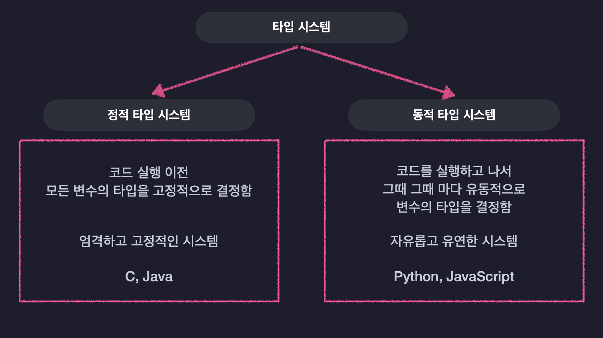
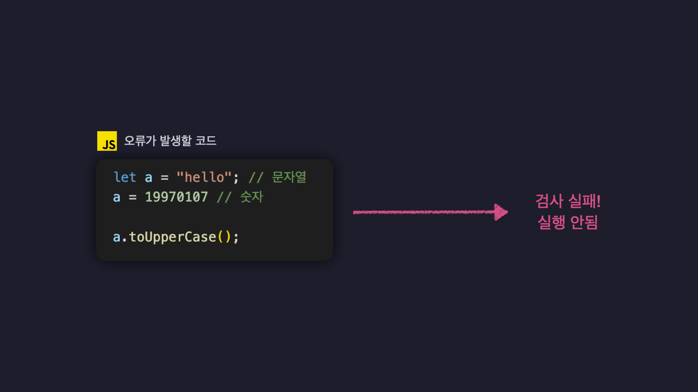
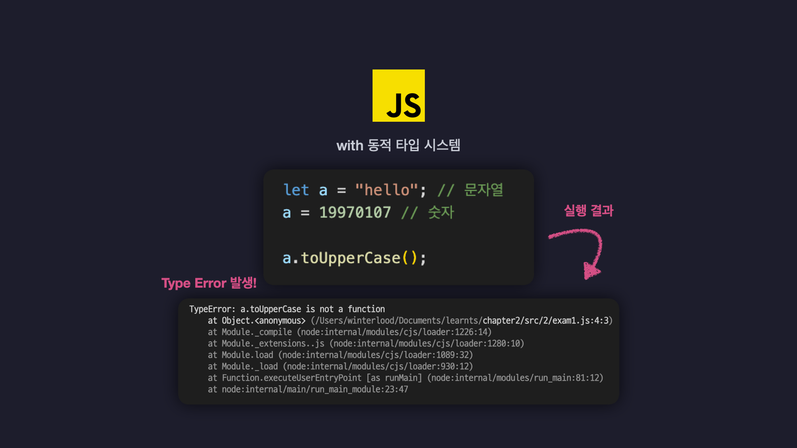
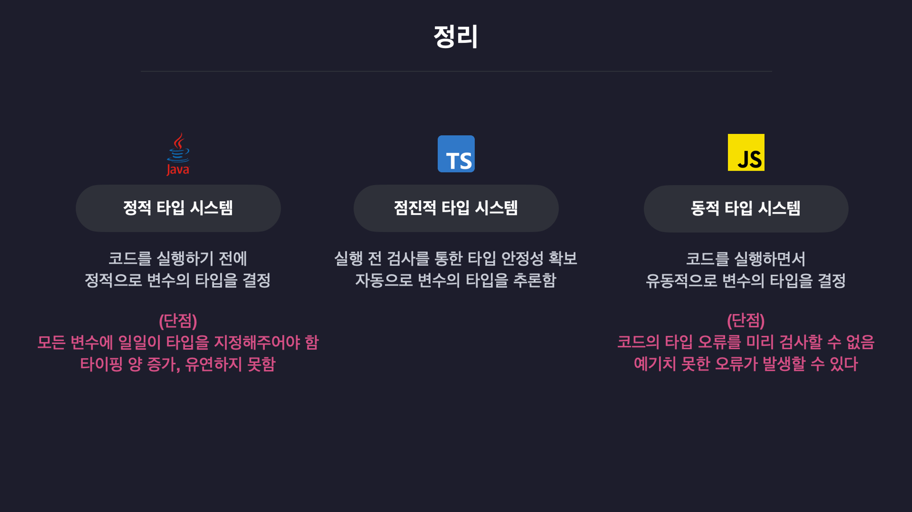
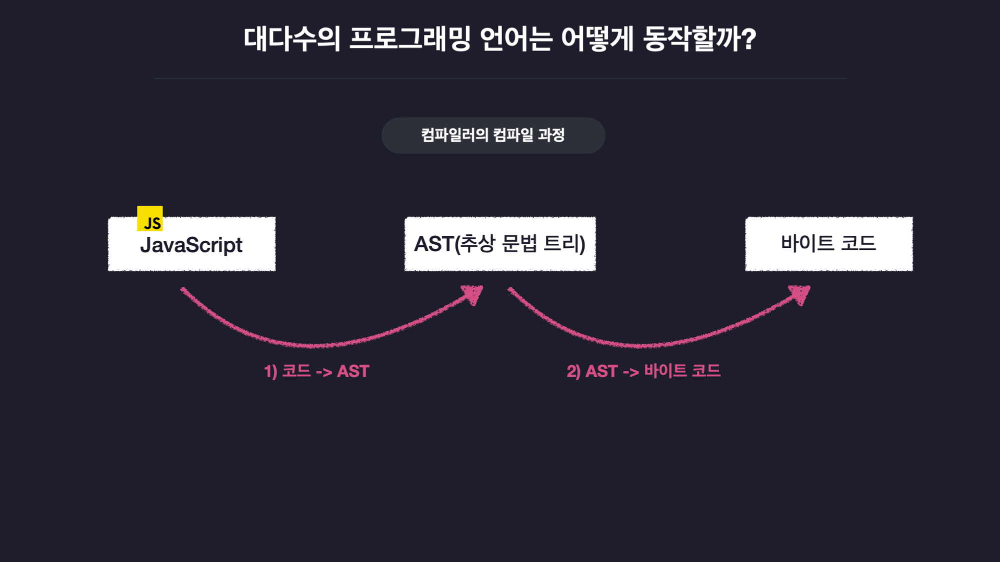
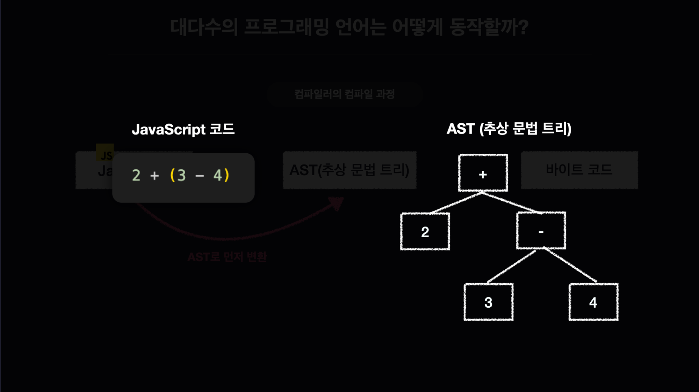
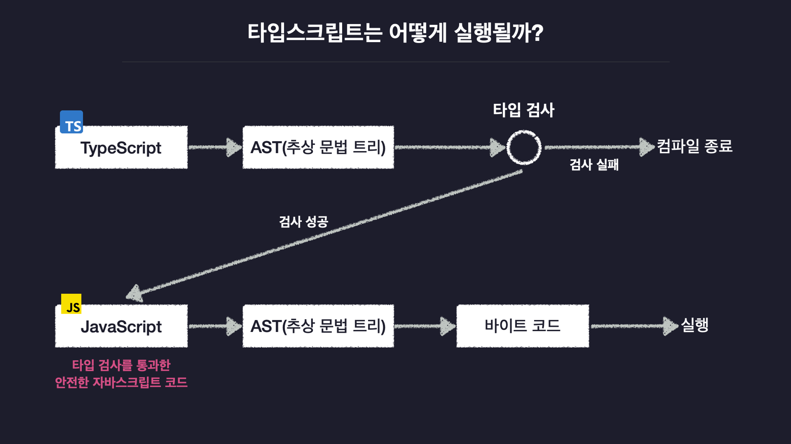

# 1. 타입스크립트 개론

## 0. 타입스크립트를 소개합니다

### 타입스크립트의 탄생
- 2012년 MS의 개발자이자 C#의 창시자 Anders Hejlsberg(앤더스 하일스버그)에 의해 탄생

### 타입스크립트는 오픈소스입니x다.
### 타입스크립트의 인기
https://stateofjs.com/en-us/

### 타입스크립트는 자바스크립트의 확장판

 
  - 자바스크립트를 더 안전하게 사용할 수 있도록 "타입 관련 기능들을 추가한" 언어
  - 자바스크립트의 기본적인 모든 문법을 포함

### 자바스크립로도 충분한데 왜 타입스크립트가 필요하죠?

- JS
  - 유연한 문법
  - 버그 발생 가능성 높음
  - 자유로움
- Node.js
  - 자바스크립트의 런타임 즉 실행 환경
  - 자바스크립트 코드르르 읽어 프로그램을 실행하는 구동기, 실행기 
  - 어디서든 자바스크립트 구동 가능
  - 무엇이든 자바스크립트로 만들 수 있게 됨
  - 웹 서버, 모바일, 데스크탑 앱 등 다양한 애플리케이션 개발 가능

- 타입스크립트 등장 배경
  - 자바스크립트의 유연함으로 인해 대규모 애플리케이션에서 안정성 떨어지는 한계점
  - 따라서 기존 문법은 유지한 채 안정성을 추가로 확보한 타입스크립트가 등장함

## 1. JS의 단점과 TS의 단점

  - 자바스크립트의 한계점
  - 타입스크립트가 이 한계점을 극복한 방법
  - 타입스크립트의 다른 언어와의 차이점

  ### 모든 프로그래밍 언어에는 타입 시스템이 있다.
  - 타입 시스템이란?
      - 언어의 타입과 관련된 문법 체계
      - 변수의 타입을 언제 결정하냐에 따라 정적/동적 타입 시스템으로 구분됨
    
  - 동적 타입 시스템
    - 코드를 실행하고 나서 그때 그때마다 유동적으로 변수의 타입을 결정함
    - 자유롭고 유연한 시스템 - 미리 변수에 타입을 지정하지 않아도 됨
    - e.g. phyton, JavaScript
  - 동적 타입 시스템의 단점
      
    
    - 코드에 타입 관련 오류를 미리 검사 할 수 없어 예기치 못한 오류가 발생할 수 있음
  - 정적 타입 시스템
    - 코드 실행 이전 모든 변수의 타입을 고정적으로 결정함
      - 변수를 선언함과 동시에 타입도 함께 명시해야함
    - 엄격하고 고정적인 시스템
    - C, Java
    - 프로그래머가 의도치 않은 실수를 런타임 이전에 확인할 수 있음
  - 정적 타입 시스템의 단점
    - 코드 타이핑 양 늘어남 : 모든 변수에 타입을 정의해야 하므로
  - 타입스크립트와 점진적 타이핑
    - 정적 타입시스템의 타입검사로 타입 안정성을 확보
    - 동적 타입 시스템처럼 변수에 모든 타입을 지정해주지 않아도 되는 유연함
    - 둘이 합쳐진 독특한 타입 시스템을 갖춘 언어
  ### 정리
  

## 2. 타입스크립트의 동작 원리

### 2-1. 대다수의 프로그래밍 언어는 어떻게 동작할까?
- 대다수의 언어는 인간 친화적
- 자바스크립트는 기계친화적 언어로 프로그래밍 언어를 컴퓨터가 이해하기 쉽게 변환해줘야 함 (=컴파일)

- 컴파일러의 컴파일 과정
  - 자바스크립트 코드-> AST로 변환-> 바이트코드로 변환-> 바이트코드 실행
  

  -  AST, 추상 문법 트리?
  - 코드의 공백이나 주석 탭 등의 코드 실행에 관계없는 요소들을 전부 제거해 트리 자료구조로 코드를 쪼개서 저장한 형태
    

### 2.2. 타입스크립트의 동작 과정
  - AST를 바이트 코드로 변환하기 전 타입 검사 수행
  - 타입 오류 시 검사 실패하여 컴파일 중단됨
    - 자바스크립트를 보다 더 안전하게 사용할 수 있음
  - 타입 검사 성공시 AST-> 자바스크립트 코드로 변환
    - 이후 과정 일반 컴파일 과정과 같음
  

## 3. Hello TS
### 타입스크립트 Hello World
- /src/secion1 폴더 생성
### Node.js 패키지 초기화
 > npm init
### @types/node 설치
> npm i @types/node
 - @types/node 라이브러리 : Node.js가 제공하는 기본 기능에 대한 타입 정보 가지고 있음
 - 미설치시 console등 타입이 선언되지 않아 컴파일 과정에서 타입검사 실패하게 됨
 - 패키지 설치시 node_modules폴더에 @types폴더 생성됨

### 타입스크립트 컴파일러 설정
  - 타입스크립트 컴파일러(TSC)
    -  npm의 TypeScript 패키지에 동봉되어 있음
  - 전역으로 typescript 패키지 설치
  > sudo npm i -g typescript

  - TSC 버전 확인
  > tsc -v
  // Version 4.9.5
### 타입스크립트 실행

#### 타입스크립트 파일 만들기
 - /src/index.ts 파일 생성
#### tsc로 컴파일하고 실행
  > tsc src/index.ts
  - 컴파일을 통해 index.js파일 생성됨
  > node src/index.js
  - 컴파일한 js파일 실행
#### ts-node로 실행
- 명령어 한번으로 타입스크립트 코드 바로 실행
> sudo npm i -g ts-node