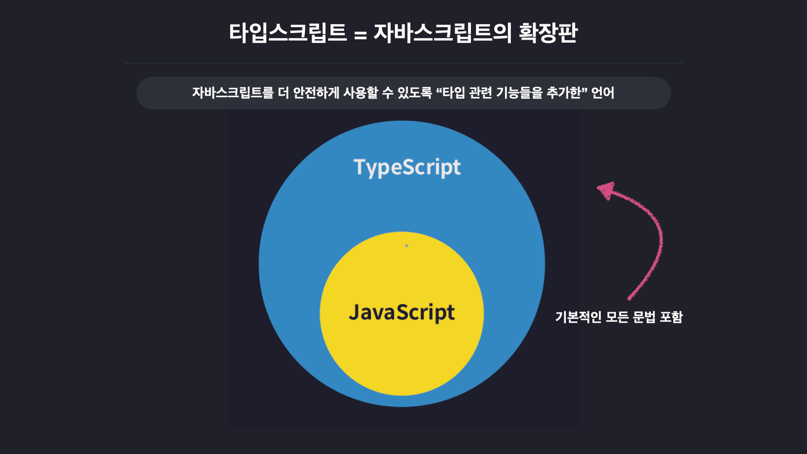

# 1. 타입스크립트 개론

## 0. 타입스크립트를 소개합니다

### 타입스크립트의 탄생
- 2012년 MS의 개발자이자 C#의 창시자 Anders Hejlsberg(앤더스 하일스버그)에 의해 탄생

### 타입스크립트는 오픈소스입니다.
### 타입스크립트의 인기
https://stateofjs.com/en-us/

### 타입스크립트는 자바스크립트의 확장판

  - 자바스크립트를 더 안전하게 사용할 수 있도록 "타입 관련 기능들을 추가한" 언어
  - 자바스크립트의 기본적인 모든 문법을 포함
### 자바스크립로도 충분한데 왜 타입스크립트가 필요하죠?

- JS
  - 유연한 문법
  - 버그 발생 가능성 높음
  - 자유로움
- Node.js
  - 자바스크립트의 런타임 즉 실행 환경
  - 자바스크립트 코드르르 읽어 프로그램을 실행하는 구동기, 실행기 
  - 어디서든 자바스크립트 구동 가능
  - 무엇이든 자바스크립트로 만들 수 있게 됨
  - 웹 서버, 모바일, 데스크탑 앱 등 다양한 애플리케이션 개발 가능

- 타입스크립트 등장 배경
  - 자바스크립트의 유연함으로 인해 대규모 애플리케이션에서 안정성 떨어짐
  - 따라서 기존 문법은 유지한 채 안정성을 추가로 확보한 타입스크립트가 등장함