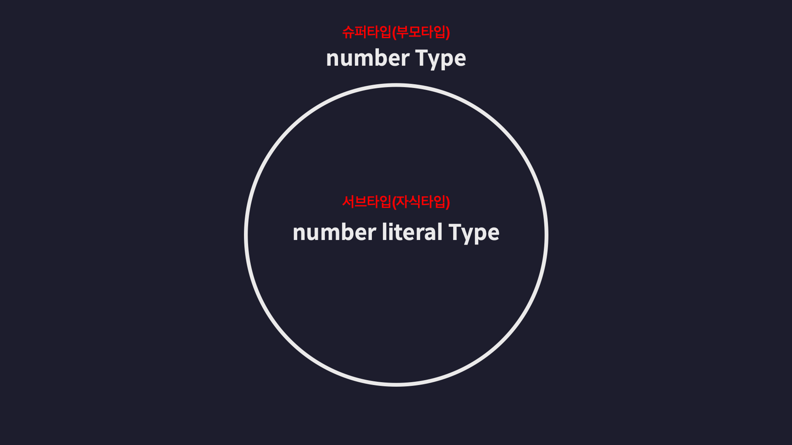
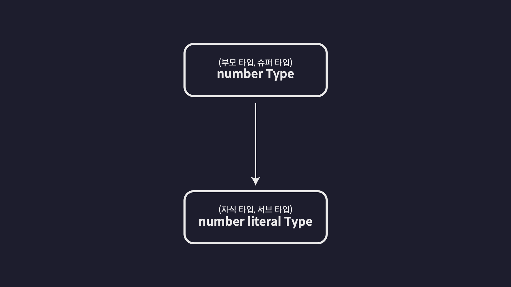
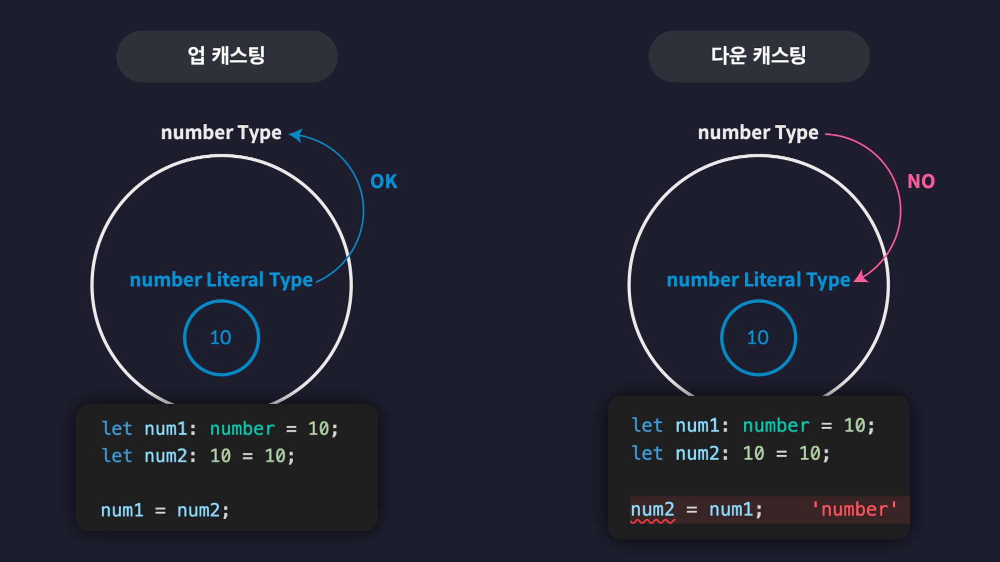
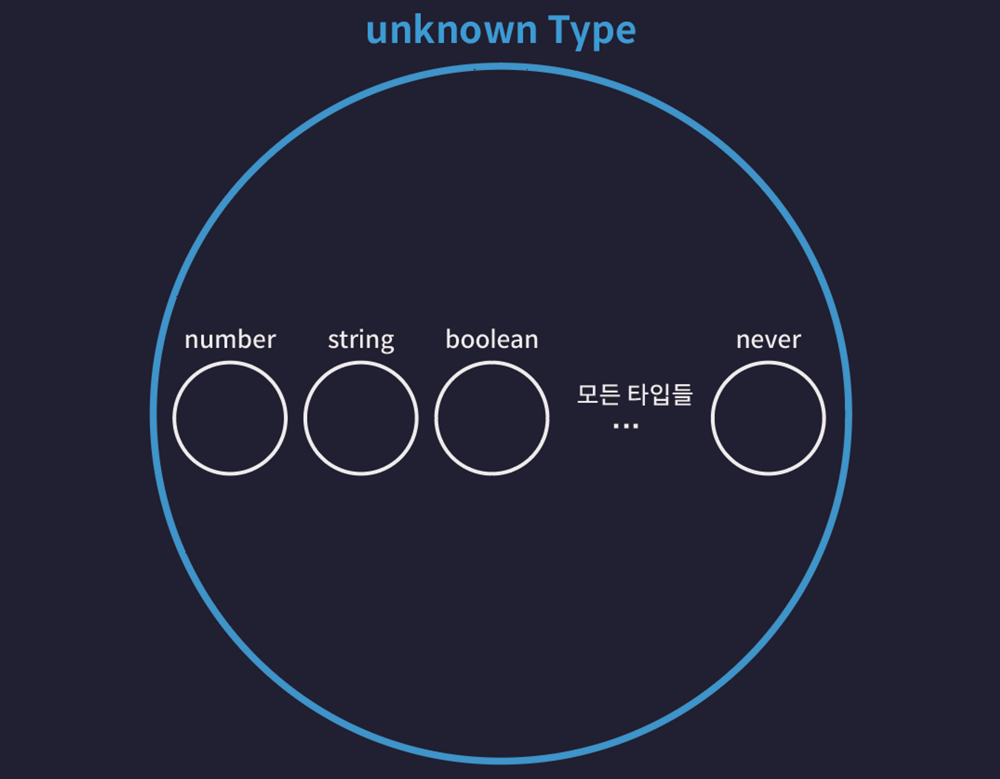
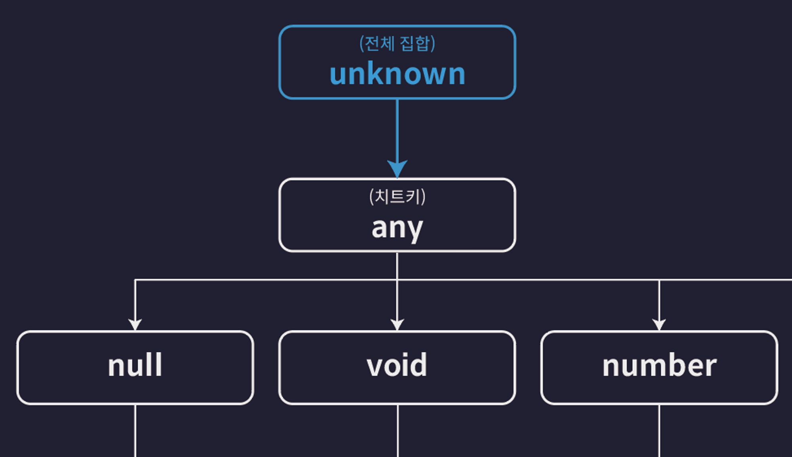

# 3. 타입스크립트 이해하기

## 0. 타입스크립트 이해하기
- 어떤 기준으로 **타입을 정의**하고
- 어떤 기준으로 **타입들간의 관계**를 정의하고
- 어떤 기준으로 **타입스크립트 코드의 오류를 검사**하는지
- 타입스크립트의 **원리**와 **동작 방식**을 이해하자!

## 1. 타입은 집합이다
### 타입은 집합이다.
- 타입은 여러개의 값을 포함하는 ‘**집합**’의 관계로 서로 포함하고 포함되는 관계
    - 집합 : 동일한 속성을 갖는 여러개의 요소들을 하나의 그룹을 묶은 단위

- 다른 타입을 포함하는 **슈퍼(부모)타입 > 서브(자식)타입 관계, 집합 / 계층 구조**
    - ex. number type > number literal type
    
    
### 타입 호환성
- 어떤 타입을 다른 타입으로 취급해도 괜찮은지 판단하는 것
- **다운 캐스팅** : 슈퍼 타입의 값을 서브타입의 값으로 취급하는 것 → TS는 대부분 허용 x
- **업캐스팅** : 서브타입의 값을 슈퍼타입의 값으로 취급하는 것

    

## 2. 타입계층도와 함께 기본타입 살펴보기
- **1) unknown 타입(전체 집합)**
    - unknown 타입 변수에는 모든 타입의 값을 할당 가능
    - 모든 타입은 unknown 타입으로 업캐스트 가능
    
    ```javascript
    let a: unknown = 1;                 // number -> unknown
    let b: unknown = "hello";           // string -> unknown
    let c: unknown = true;              // boolean -> unknown
    let d: unknown = null;              // null -> unknown
    let e: unknown = undefined;         // undefined -> unknown
    let f: unknown = [];                // Array -> unknown
    let g: unknown = {};                // Object -> unknown
    let h: unknown = () => {};          // Function -> unknown
    ```
    
    - **모든 타입의 슈퍼타입이라는 뜻(전체집합)**
    - **모든 타입은 unknown 타입의 부분집합**
    

    
- **2) never 타입  (공집합 타입)**
    - 불가능, 모순을 의미하는 타입
    - 아무것도 포함하지 않는 공집합
    -   공집합은 모든 집합의 부분집합 → never는 모든 타입의 서브 타입
    - 모든 타입으로 업캐스팅 가능
        
        ```javascript
        let neverVar: never;
        
        let a: number = neverVar;            // never -> number
        let b: string = neverVar;            // never -> string
        let c: boolean = neverVar;           // never -> boolean
        let d: null = neverVar;              // never -> null
        let e: undefined = neverVar;         // never -> undefined
        let f: [] = neverVar;                // never -> Array
        let g: {} = neverVar;                // never -> Object
        ```
        
    - 어떤 타입도 never로 다운캐스팅 불가능
        
        ```javascript
        let a: never = 1;                 // number -> never ❌
        let b: never = "hello";           // string -> never ❌
        let c: never = true;              // boolean -> never ❌
        let d: never = null;              // null -> never ❌
        let e: never = undefined;         // undefined -> never ❌
        let f: never = [];                // Array -> never ❌
        let g: never = {};                // Object -> never ❌
        ```
        
    
- **3) void 타입**
    - 아무것도 반환하지 않는 함수의 반환값 타입
    
- undefined의 슈퍼타입
- void타입의 서브타입은 **undefined , never**만 있음, 이외 다른 값 할당 불가능
    ```javascript
    let voidVar: void;

    voidVar = undefined; // undefined -> void (ok)

    let neverVar: never;
    voidVar = neverVar; // never -> void (ok)

    ```

 - **3-1) any 타입(치트키)**
    - 타입 계층도를 무시하는 타입(치트키)
    - 모든 타입의 슈퍼타입이 될 수도, 서브타입이 될 수도 있음

    ```javascript
    let anyValue: any;

    let num: number = anyValue;   // any -> number (다운 캐스트)
    let str: string = anyValue;   // any -> string (다운 캐스트)
    let bool: boolean = anyValue; // any -> boolean (다운 캐스트)

    anyValue = num;  // number -> any (업 캐스트)
    anyValue = str;  // string -> any (업 캐스트)
    anyValue = bool; // boolean -> any (업 캐스트)
    ```

## 3. 객체 타입의 호환성
### 객체 타입의 호환성
```javascript
    type Animal = {
        name: string;
        color: string;
    };
    
    type Dog = {
        name: string;
        color: string;
        breed: string;
    };

    let animal: Animal = {
        name: "기린",
        color: "yellow",
    };

    let dog: Dog = {
        name: "뚱뚱이",
        color: "white",
        breed: "진도",
    };

    animal = dog; // ✅ OK
    dog = animal; // ❌ NO
```
- Animal 타입은 name, color 프러퍼티를 갖는 모든 객체를 포함하는 집합으로 볼 수 있음
### 초과 프로퍼티 검사
    
- 객체를 객체리터럴로 초기화할 때 발동하는 타입스크립트의 특수한 기능
- 타입에 정의된 프로퍼티 외에 초과된 프러퍼티를 갖는 객체를 변수에 할당할 수 없음
- 값을 별도의 다른 변수에 보관한 다음 변수 값을 초기화 값으로 사용하면 에러 발생하지 않음

```javascript
type Book = {
    name: string;
    price: number;
};

type ProgrammingBook = {
    name: string;
    price: number;
    skill: string;
};

let book: Book;
let programmingBook: ProgrammingBook = {
    name: "타입스크립트",
    price: 33000,
    skill: "typescript",
};

let book2: Book = { // ❌ 오류발생
    name: "리액트",
    price: 32000,
    skill: "react",
};

let book3: Book = programmingBook; // 앞서 만들어둔 변수
```

- 함수의 매개변수에 인수의 값을 전달할 때도, 변수에 미리 값을 담아 놓은 뒤 변수값 인수로 전달해야 함
```javascript
function func(book: Book) {}

func({ // 오류 발생
  name: "한 입 크기로 잘라먹는 리액트",
  price: 33000,
  skill: "reactjs",
});

func(programmingBook);
```

## 4. 대수 타입(Algebraic type)
- 여러 개의 타입을 합성해서 만드는 타입

### 1) 합집합(Union) 타입
```typescript
// 합집합 타입 - Union 타입
let a: string | number; 
```

#### Union 타입으로 배열 타입 정의하기
```typescript
let arr: (number | string | boolean)[] = [1, "hello", true];
```

#### Union 타입과 객체 타입
```typescript

type Dog = {
  name: string;
  color: string;
};

type Person = {
  name: string;
  language: string;
};

type Union1 = Dog | Person;
```

### 2) 교집합(Intersection) 타입
```typescript
let variable: number & string;
// never 타입으로 추론된다
// number 타입과 string 타입은 서로 교집합을 공유하지 않는 서로소 집합이므로 교집합이 없어서
```

#### Intersection 타입과 객체 타입

```typescript
type Dog = {
  name: string;
  color: string;
};

type Person = {
  name: string;
  language: string;
};

type Intersection = Dog & Person;

let intersection1: Intersection = {
  name: "",
  color: "",
  language: "",
};
```

## 5. 타입 추론
- 타입추론 : 타입이 정의되어 있지 않은 변수의 타입을 자동 추론하는 기능

### 타입 추론이 가능한 상황들
#### 1. 변수 선언
```typescript
let a = 10;
// number 타입으로 추론

let b = "hello";
// string 타입으로 추론

let c = {
  id: 1,
  name: "김수진",
  profile: {
    nickname: "sujin",
  },
  urls: ["https://sujin.com"],
};
// id, name, profile, urls 프로퍼티가 있는 객체 타입으로 추론

```

#### 2. 구조분해할당
```typescript
let { id, name, profile } = c;

let [one, two, three] = [1, "hello", true];
```

#### 3. 함수의 반환값
```typescript
function func() {
  return "hello";
}
// 반환값이 string 타입으로 추론된다
```

#### 4. 기본값이 설정된 매개변수
```typescript
function func(message = "hello") {
  return "hello";
}
```

### 주의해야 할 상황들
#### 1. 암시적으로 any타입으로 추론
```typescript
let d;
d = 10;
d.toFixed();

d = "hello";
d.toUpperCase();
d.toFixed(); // 오류 
```
#### 2. const 상수의 추론 
```typescript
const num = 10;
// 10 Number Literal 타입으로 추론

const str = "hello";
// "hello" String Literal 타입으로 추론
```

### 최적 공통 타입
- 다양한 타입의 요소를 담은 배열을 변수의 초기값으로 설정하면, 최적의 공통 타입으로 추론됨
```typescript
let arr = [1, "string"];
// (string | number)[] 타입으로 추론
```

## 6. 타입 단언
- 값 as 타입으로 특정 값을 원하는 타입으로 단언하는 기능
```typescript

type Person = {
  name: string;
  age: number;
};

// 이 빈 객체를 Person 타입이라고 타입스크립트에게 단언
let person = {} as Person;
person.name = "";
person.age = 23; 
```

- 초과 프로퍼티 검사 피할때 사용 가능
- 
```typescript
type Dog = {
  name: string;
  color: string;
};

let dog: Dog = {
  name: "돌돌이",
  color: "brown",
  breed: "진도",
} as Dog
```

### 타입 단어의 조건
- 값 as 타입 형식의 단언식을 A as B로 표현했을 때 아래의 두가지 조건중 한가지를 반드시 만족해야 합니다.
    A가 B의 슈퍼타입이다
    A가 B의 서브타입이다

```typescript
let num1 = 10 as never;   // ✅  never 타입은 모든 타입의 서브타입이므로  A가 B의 슈퍼타입
let num2 = 10 as unknown; // ✅  unknown 타입은 모든 타입의 슈퍼타입이므로 A가 B의 서브타입

let num3 = 10 as string;  // ❌ number 타입과 string 타입은 서로 슈퍼-서브 타입 관계를 갖지 않음
```

### 다중 단언
```typescript
let num3 = 10 as unknown as string;
```

- 중간에 값을 unknown 타입으로 단언하면 unknown 타입은 모든 타입의 슈퍼타입이므로 모든 타입으로 또 다시 단언하는게 가능
- but, 좋지 않은 방법💩


### const 단언
- 특정 값을 const 타입으로 단언하면 마치 변수를 const로 선언한 것 과 비슷하게 타입이 변경됨

```typescript
let num4 = 10 as const;
// 10 Number Literal 타입으로 단언됨

let cat = {
  name: "야옹이",
  color: "yellow",
} as const;
// 모든 프로퍼티가 readonly를 갖도록 단언됨
```

### Non Null 단언
- 값 as 타입 형태를 따르지 않는 단언
- 값 뒤에 !를 붙여주면 이 값이 undefined이거나 null이 아닐것으로 단언할 수 있음

```typescript
type Post = {
  title: string;
  author?: string;
};

let post: Post = {
  title: "게시글1",
};

const len: number = post.author!.length;
```

## 7. 타입 좁히기
```typescript
function func(value: number | string) {}
```

- 매개변수 value 타입을 number나 string 타입으로 기대하고 메서드 사용시 오류 발생
  
```typescript
function func(value: number | string) {
    value.toFixed(); // 오류
    value.toUpperCase(); // 오류
}
```

- 조건문으로 value 타입이 number타입임을 보장해야함
```typescript
function func(value: number | string) {
    if (typeof value === "number") {
        console.log(value.toFixed());
    }
}
```

### 타입 가드
  -  if (typeof === …) 처럼 조건문 함께 사용해 타입을 좁히는 표


### 타입 좁히기
```typescript
function func(value: number | string) {
    if (typeof value === "number") {
        console.log(value.toFixed());
    } else if (typeof value === "number") {
        console.log(value.toFixed());
    }    
}
```

### instanceof 타입가드

- 내장 클래스 타입을 보장할 수 있음
- 직접 만든 타입과 사용 불가
  
```typescript
function func(value: number | string | Date | null) {
  if (typeof value === "number") {
    console.log(value.toFixed());
  } else if (typeof value === "string") {
    console.log(value.toUpperCase());
  } else if (value instanceof Date) {
    console.log(value.getTime());
  }
}
```

###  in 타입 가드
- 직접 만든 타입과 함께 사용가능
  
```typescript
type Person = {
    name: string;
    age: number;
};

function func(value: number | string | Date | null | Person) {
    if (typeof value === "number") {
        console.log(value.toFixed());
    } else if (typeof value === "number") {
        console.log(value.toUpperCase());
    } else if (value instanceof Date) {
        console.log(value.getTime());
    } else if(value && "age" in value) {
        console.log(`${value.name}은 ${value.age}살 입니다`);
    }
}


```


## 8. 서로소 유니온 타입
